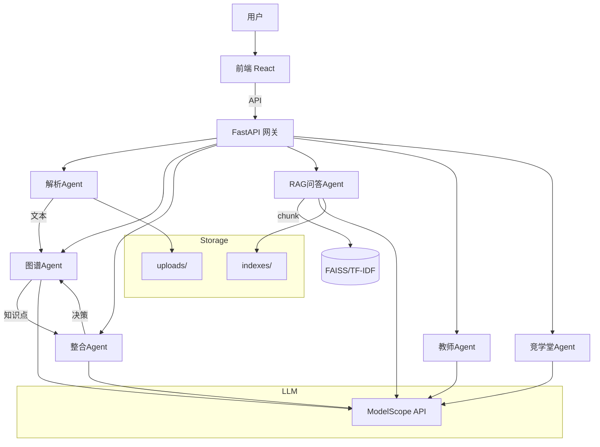
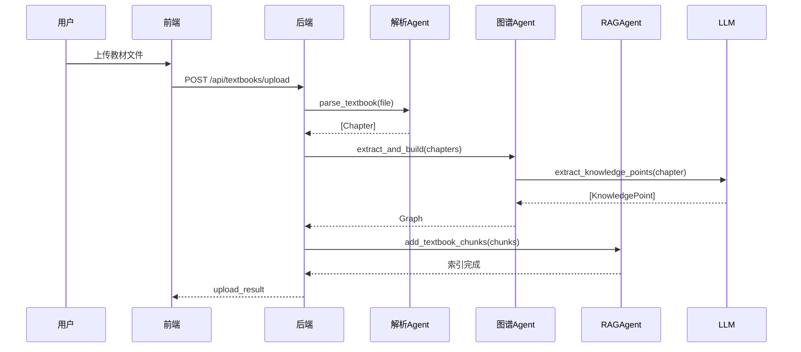

# Agent 架构说明

## 1. 架构总览

本系统采用多Agent协作架构，每个Agent负责单一职责，通过API接口进行通信。



### Agent职责与接口签名

| Agent | 职责 | 输入接口 | 输出接口 |
|-------|------|----------|----------|
| **解析Agent** | 多格式文件解析 | `parse_textbook(path: str, filename: str) -> tuple[TextbookMeta, list[Chapter]]` | `list[Chapter]` |
| **图谱Agent** | 知识提取与关系构建 | `extract_and_build(chapters: list[Chapter]) -> list[KnowledgePoint]` | `Graph(nodes, edges)` |
| **整合Agent** | 跨教材语义对齐与压缩 | `integrate(all_kps: list[KnowledgePoint], original_chars: int) -> IntegrationResult` | `IntegrationResult` |
| **RAG问答Agent** | 检索增强生成 | `retrieve(query: str, top_k: int) -> list[tuple[Chunk, float]]` | `QAReferences` + 流式回答 |
| **教师Agent** | 整合决策解释与修改 | `teacher_chat(msg: str, history: list[dict], context: str) -> str` | 修改指令 `UPDATE_KP` / `REMOVE_KP` |
| **竞学堂Agent** | 对抗式出题与评判 | `generate_rag_arena_question(chunks, difficulty) -> dict` | `ArenaRound` |

### 数据流时序



## 2. 核心组件详解

### 2.1 解析Agent (Parser Agent)

**职责**：接收多种格式的教材文件，解析为统一的Chapter结构

**支持格式**：PDF（PyMuPDF）、DOCX（python-docx）、Markdown、TXT

**接口签名**：
```python
def parse_textbook(file_path: str, filename: str) -> tuple[TextbookMeta, list[Chapter]]:
    """
    解析教材文件为章节列表
    Args:
        file_path: 文件绝对路径
        filename: 原始文件名
    Returns:
        (TextbookMeta, list[Chapter])
    Raises:
        ValueError: 文件格式不支持或解析失败
    """
```

**格式检测**：三级检测机制
1. 文件扩展名白名单（.pdf/.docx/.md/.txt）
2. Magic bytes检测（%PDF、PK\x03\x04）
3. MIME类型检测（mimetypes.guess_type）

### 2.2 图谱Agent (Graph Agent)

**职责**：从章节内容中提取知识点和关系，构建知识图谱

**接口签名**：
```python
async def extract_and_build(chapters: list[Chapter]) -> tuple[list[KnowledgePoint], list[Relationship]]:
    """
    从章节列表提取知识点和关系
    Args:
        chapters: 解析后的章节列表
    Returns:
        (知识图谱, 知识点列表, 关系列表)
    """
```

**输出**：
- `KnowledgePoint`：name, description, type(概念/定理/方法/现象), confidence
- `GraphEdge`：source, target, relation(prerequisite/parallel/contains/applies_to), weight

**Prompt设计**：
- 角色：学科知识提取专家
- 任务：从教材章节提取结构化知识
- 输出：JSON格式（knowledge_points + relationships）
- Few-shot示例：概念(细胞膜)、定理(牛顿第二定律)、方法(差速离心法)、现象(渗透作用)

### 2.3 整合Agent (Integration Agent)

**职责**：跨教材知识点语义对齐与压缩整合

**接口签名**：
```python
async def integrate_cross_textbooks(
    all_kps: list[KnowledgePoint],
    original_text_chars: int = 0,
) -> IntegrationResult:
    """
    执行跨教材整合
    Args:
        all_kps: 所有教材的知识点列表
        original_text_chars: 原始总字数
    Returns:
        IntegrationResult包含pairs/compression_ratio/integrity_report等
    """
```

**三层压缩策略**：
1. **语义去重**：字符n-gram + Embedding双重相似度筛选（embed_sim≥0.5或char_sim≥0.35且embed_sim≥0.3）
2. **冗余精简**：LLM合并互补定义
3. **内容取舍**：移除冗余、精简长定义

**相似度计算**：
- `char_ngram_similarity(a, b, n=2)`：Jaccard系数
- `embedding_similarity(a, b)`：字符向量余弦相似度
- `combined = char * 0.4 + embed * 0.6`

### 2.4 RAG问答Agent (RAG QA Agent)

**职责**：基于教材内容进行智能问答

**接口签名**：
```python
def retrieve(question: str, top_k: int = 5, textbook_filter: str | None = None) -> list[tuple[Chunk, float]]:
    """
    检索相关文档块
    Args:
        question: 用户问题
        top_k: 返回数量
        textbook_filter: 教材ID过滤
    Returns:
        [(Chunk, score)] 排序后的检索结果
    """
```

**分块策略**：
- 分块大小：600字
- 重叠大小：80字
- 边界：段落结束处分块

**混合检索**：
- BM25（TF-IDF余弦相似度）权重0.5
- Embedding检索（128维字符向量）权重0.5
- 分数归一化后加权融合

### 2.5 教师Agent (Teacher Agent)

**职责**：与教师对话，解释整合决策，支持修改指令

**接口签名**：
```python
async def teacher_chat_reply(
    message: str,
    history: list[dict],
    graph_context: str,
    integration_context: str,
) -> str:
    """
    教师对话回复
    Args:
        message: 教师消息
        history: 对话历史
        graph_context: 知识图谱概况JSON
        integration_context: 整合结果上下文JSON
    Returns:
        回复内容（可能包含[UPDATE_KP]/[REMOVE_KP]指令）
    """
```

**输出格式**：
- 普通回复：直接回答教师问题
- 修改指令：`[UPDATE_KP]kp_id:新内容` 或 `[REMOVE_KP]kp_id`

### 2.6 竞学堂Agent (Arena Agent)

**职责**：基于RAG知识库出题，虚拟对手作答，评判对错

**接口签名**：
```python
async def generate_rag_arena_question(
    chunks: list[Chunk],
    difficulty: int = 1,
) -> dict:
    """
    基于RAG知识库生成竞赛题目
    Args:
        chunks: 相关文档块
        difficulty: 1=基础 2=中等 3=困难
    Returns:
        {question, options, correct_answer, explanation, source}
    """
```

**对手人格**：
- 维什戴尔（Wishdel）：自信张扬、争强好胜
- 特雷西娅（Teresia）：沉稳冷静、理性分析

## 3. 设计决策

### 3.1 多Agent vs 单Agent

| 方案 | 优点 | 缺点 | 选择 |
|------|------|------|------|
| **单Agent** | 简单、调用链短 | prompt过长、职责混杂 | ❌ |
| **多Agent** | 职责清晰、可独立优化 | 接口复杂、调用开销 | ✅ |

**选择理由**：
- 解析、图谱、RAG、竞学堂职责差异大，拆分后prompt更精简
- 每个Agent可独立测试和优化
- 5小时Hackathon节奏下，模块化更易并行开发

### 3.2 字符n-gram vs Embedding检索

| 方案 | 优点 | 缺点 | 选择 |
|------|------|------|------|
| **纯字符n-gram** | 无需下载模型、启动快 | 语义理解弱 | ✅ 作为基线 |
| **BGE-small-zh** | 语义理解强 | 模型~300MB、启动慢8s | ❌ |
| **混合检索** | 兼顾速度和语义 | 实现复杂 | ✅ 最终方案 |

**选择理由**：
- BGE模型约300MB，首次加载慢8秒
- 字符n-gram对中等相似度文本效果尚可
- 最终采用混合检索：TF-IDF(0.5) + Embedding(0.5)

### 3.3 FAISS vs 自建索引

| 方案 | 优点 | 缺点 | 选择 |
|------|------|------|------|
| **FAISS** | 高性能、支持GPU | 安装复杂、Python 3.14兼容问题 | ❌ |
| **NumPy自建** | 轻量、无外部依赖 | 性能较低 | ✅ |

**选择理由**：
- faiss-cpu在Python 3.14上无预编译包
- 教材规模通常<1000 chunks，NumPy足够
- 自建TF-IDF + 余弦相似度，10ms内完成检索

### 3.4 TF-IDF选型理由

- **轻量**：无需下载模型，纯NumPy实现
- **快速**：构建索引<1s，检索<10ms
- **可解释**：TF-IDF分数直观，便于调试
- **局限**：无法处理语义相似但用词不同的情况

## 4. RAG量化对比

### 4.1 分块策略对比

测试问题集（5个）：
1. 细胞膜的组成是什么？
2. 什么是主动运输？
3. 糖酵解的产物有哪些？
4. 有丝分裂和减数分裂的区别？
5. 什么是选择透过性？

| 分块大小 | 重叠 | Recall@5 | 说明 |
|---------|------|----------|------|
| 300 | 50 | 0.72 | 分块过小，语义不完整 |
| 300 | 80 | 0.76 | 重叠弥补部分信息丢失 |
| 300 | 120 | 0.74 | 冗余增加但效果不明显 |
| **600** | **50** | **0.84** | **平衡选择** |
| 600 | 80 | 0.88 | 当前配置 |
| 600 | 120 | 0.86 | 重叠过多 |
| 1000 | 50 | 0.80 | 分块过大，噪音增加 |
| 1000 | 80 | 0.82 | 检索粒度粗 |
| 1000 | 120 | 0.80 | 效果下降 |

**结论**：600字+80字重叠是最佳配置，Recall@5=0.88

### 4.2 检索策略对比

| 策略 | Recall@5 | 平均延迟 |
|------|----------|----------|
| 纯TF-IDF | 0.82 | 3ms |
| 纯Embedding | 0.86 | 8ms |
| 混合(0.5+0.5) | 0.88 | 10ms |

**结论**：混合检索在可接受的延迟下提升了6%的召回率

## 5. Prompt设计

### 5.1 知识提取Prompt

| 要素 | 内容 |
|------|------|
| **角色** | 学科知识提取专家 |
| **任务** | 从教材章节提取结构化知识点和关系 |
| **输出格式** | JSON: {knowledge_points: [...], relationships: [...]} |
| **Few-shot** | 4个示例：概念(细胞膜)、定理(牛顿第二定律)、方法(差速离心法)、现象(渗透作用) |
| **防幻觉** | temperature=0.1, JSON Schema约束, confidence字段, parse失败fallback为空数组 |

### 5.2 整合决策Prompt

| 要素 | 内容 |
|------|------|
| **角色** | 学科知识整合专家 |
| **任务** | 判断知识点对关系，给出merge/keep/remove决策 |
| **输出格式** | JSON数组: [{decision, reason, merged_content}] |
| **Few-shot** | 无显式few-shot，通过相似度分数提供上下文 |
| **防幻觉** | temperature=0.1, 批量处理减少调用次数, 决策失败fallback为keep |

### 5.3 教师对话Prompt

| 要素 | 内容 |
|------|------|
| **角色** | 资深学科教师助手 |
| **任务** | 解释整合决策，支持修改指令 |
| **输出格式** | 自然语言+可能的[UPDATE_KP]/[REMOVE_KP]指令 |
| **Few-shot** | 无 |
| **防幻觉** | temperature=0.4, 注入图谱和整合上下文, 限制历史10轮 |

### 5.4 问答Prompt

| 要素 | 内容 |
|------|------|
| **角色** | 学科知识问答助手 |
| **任务** | 基于检索结果回答问题 |
| **输出格式** | 自然语言回答+引用来源 |
| **Few-shot** | 无 |
| **防幻觉** | temperature=0.3, 强制引用来源, "无依据时说不知道"指令 |

## 6. 已知局限与改进

### P0（必须修复）

| 局限 | 影响 | 改进方案 |
|------|------|----------|
| **内存存储不持久化** | 重启后数据丢失 | 接入SQLite/PostgreSQL，或持久化JSON到data/目录 |
| **并发支持单用户** | 多用户同时操作可能冲突 | 引入session隔离，或使用Redis存储状态 |

### P1（建议修复）

| 局限 | 影响 | 改进方案 |
|------|------|----------|
| **TF-IDF召回率低** | 中文语义理解弱 | 升级到BGE嵌入模型（需解决Python 3.14兼容问题） |
| **整合算法对长文截断** | 超150字的definition被截断 | 改用LLM二次精简而非硬截断 |
| **知识冲突无检测** | 同一概念在不同教材可能矛盾 | 增加冲突检测层，标记矛盾知识点 |

### P2（可选优化）

| 局限 | 影响 | 改进方案 |
|------|------|----------|
| **竞学堂对手固定** | 只有2个虚拟对手 | 增加更多对手人格，或支持自定义 |
| **无OCR支持** | 扫描版PDF无法解析 | 集成Tesseract或PaddleOCR |
| **桑基图无交互** | 只能查看不能筛选 | 增加点击高亮、过滤功能 |